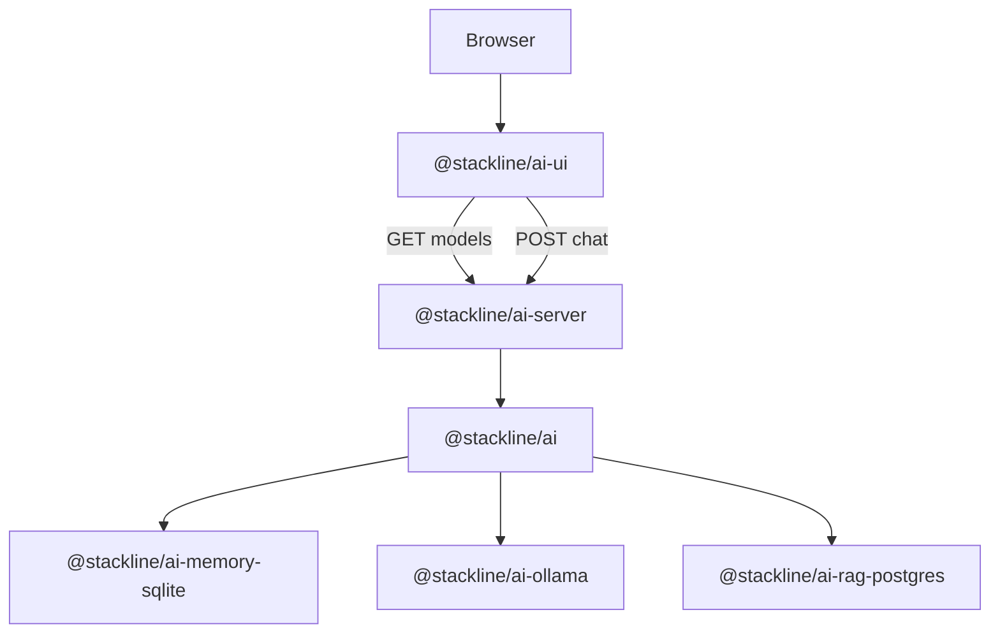

# Architecture

Stackline AI separates browser UI, HTTP transport, core orchestration, provider
adapters, memory, and RAG. The browser never needs provider API keys, database
connection strings, SQL, or memory paths.



## Runtime Boundary

Browser package:

- `@stackline/ai-ui`

Backend packages:

- `@stackline/ai`
- `@stackline/ai-server`
- `@stackline/ai-ollama`
- `@stackline/ai-memory-sqlite`
- `@stackline/ai-rag-postgres`

Required for a basic Ollama app:

- `@stackline/ai`
- `@stackline/ai-server`
- `@stackline/ai-ollama`
- `@stackline/ai-ui`

Optional:

- `@stackline/ai-memory-sqlite`
- `@stackline/ai-rag-postgres`

## Model Selection

The UI loads models from `GET /api/ai/models` and sends the selected model to
`POST /api/ai/chat`. If the UI has no selected model, it selects the first model
returned by the backend.

The Ollama provider accepts an explicit model or `model: "auto"`. In auto mode,
it calls `/api/tags`, skips model names that look like image, embedding, rerank,
or vision-only models, and chooses the first likely chat model. If no model is
available, it throws:

```text
Ollama chat requires a model. Use a model name or model: "auto".
```

## RAG Flow

When RAG is enabled:

1. The core reads the latest chat request.
2. The configured retriever returns `StacklineRagContext[]`.
3. The core prepends a `system` message with `metadata.stacklineRagContext`.
4. The provider receives a normal `StacklineChatRequest`.
5. The response includes `metadata.stacklineRag` with source evidence.

Providers do not implement RAG. RAG stays provider-neutral.

## Memory Flow

Memory stores implement `StacklineMemoryStore`. The core writes conversation
interactions after a response. By default, RAG evidence and context excerpts are
not persisted. Opt in only when your audit policy allows it.

## Error Flow

Provider, validation, and RAG errors become HTTP JSON errors through
`@stackline/ai-server`:

```json
{
  "error": {
    "message": "messages must be an array.",
    "status": 400
  }
}
```

Model allow-list failures return `403`.

## Streaming

Provider contracts include optional `streamChat`, and Ollama capabilities mark
streaming as available. The current HTTP handler exposes non-streaming
`POST /chat` only.

