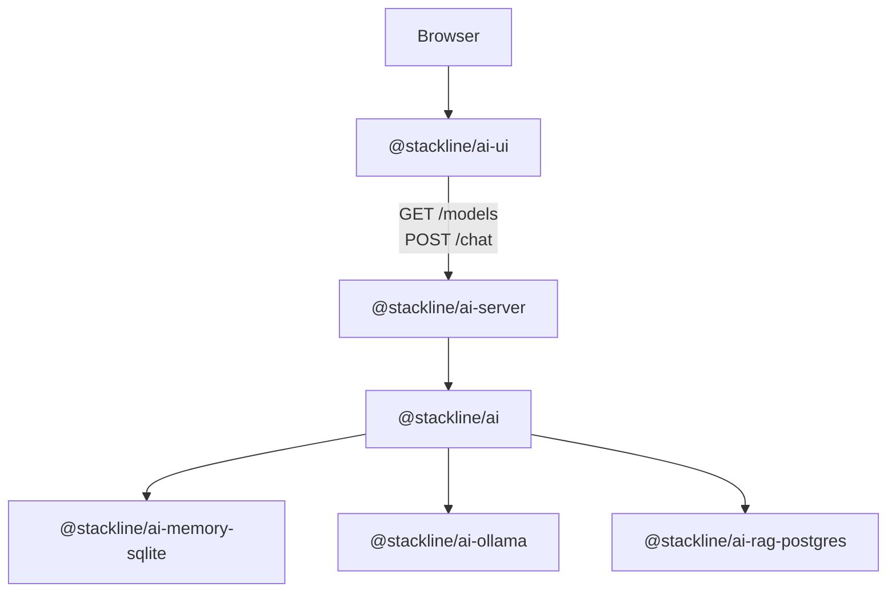

# Stackline AI Documentation Audit

Date: 2026-06-21

This audit was created from the real repository files, package manifests,
source code, generated declaration files, tests, examples, build output, and
pack dry-run output.

## Repository Structure

```text
stackline-ai/
├── docs/
├── examples/
│   ├── complete-stack/
│   ├── express-adapter/
│   ├── full-stack-vite/
│   ├── local-demo/
│   ├── ollama-minimal/
│   ├── postgres-rag/
│   └── sqlite-memory/
├── packages/
│   ├── ai/
│   ├── memory-sqlite/
│   ├── provider-ollama/
│   ├── rag-postgres/
│   ├── server/
│   └── ui/
├── scripts/
├── package.json
├── pnpm-lock.yaml
└── pnpm-workspace.yaml
```

The monorepo uses pnpm workspaces:

```yaml
packages:
  - "packages/*"
  - "examples/*"
```

## Tooling And Runtime

- Repository package manager: `pnpm@11.5.2`.
- Repository development Node.js: `>=22.13.0`. This is required by pnpm 11 in
  this repository; Node 20.20.2 failed because pnpm required `node:sqlite`.
- Consumer package runtime: `>=18.17.0` is declared for the published packages
  because the server/provider contracts depend on modern ESM and Fetch API
  primitives (`Request`, `Response`, `fetch`).
- Vite examples require Node `^20.19.0 || >=22.12.0` through Vite 7.3.5.
- All packages are ESM (`"type": "module"`).

## Package Matrix

| Package | Runtime | Responsibility | Main exports | Dependencies | Optional integrations |
|---|---|---|---|---|---|
| `@stackline/ai` | Backend / shared TypeScript contracts | Provider-neutral core, RAG orchestration, memory capture, direct RAG answers, model listing | `createStacklineAIServer`, contracts from `StacklineAIProvider` through `StacklineAIServer` | none | provider adapters, memory stores, RAG retrievers |
| `@stackline/ai-server` | Backend | Fetch-compatible HTTP handler for Stackline AI routes | `createStacklineAIHttpHandler` | `@stackline/ai` | Node HTTP, Express adapter, Vite dev middleware |
| `@stackline/ai-ollama` | Backend | Ollama provider adapter | `ollamaProvider` | `@stackline/ai` | local Ollama, Ollama-compatible API, Ollama Cloud with backend-held key |
| `@stackline/ai-memory-sqlite` | Backend / local storage | sql.js-backed conversation memory store | `createSqliteMemoryStore` | `@stackline/ai`, `sql.js` | local development, tests, private single-instance demos |
| `@stackline/ai-rag-postgres` | Backend / database | Read-only PostgreSQL RAG retriever | `createPostgresRagRetriever` | `@stackline/ai`, `pg` | views, read-only users, custom query builders |
| `@stackline/ai-ui` | Browser | Framework-neutral Studio web component | `defineStacklineAIStudio`, `stacklineAIStudioTagName`, UI helpers and types | `@stackline/multiselect` | Vanilla, Angular, React, Vue, Vite, any custom-element host |

## Export Map

### `@stackline/ai`

```json
{
  ".": {
    "types": "./dist/index.d.ts",
    "import": "./dist/index.js"
  },
  "./server": {
    "types": "./dist/index.d.ts",
    "import": "./dist/index.js"
  }
}
```

Confirmed root exports:

- `createStacklineAIServer`
- `StacklineAIProvider`
- `StacklineAIProviderCapabilities`
- `StacklineAIModel`
- `StacklineChatRequest`
- `StacklineChatResponse`
- `StacklineRagRetriever`
- `StacklineRagContext`
- `StacklineMemoryStore`
- `StacklineMemoryInteraction`
- `StacklineAIServer`
- `StacklineAIServerConfig`

`@stackline/ai/server` is a real exported subpath. It currently resolves to the
same ESM bundle as the root export.

### `@stackline/ai-server`

Confirmed exports:

- `createStacklineAIHttpHandler`
- `StacklineAIHttpHandler`
- `StacklineAIHttpHandlerOptions`
- `StacklineAICorsOptions`

### `@stackline/ai-ollama`

Confirmed exports:

- `ollamaProvider`
- `OllamaProviderOptions`

### `@stackline/ai-memory-sqlite`

Confirmed exports:

- `createSqliteMemoryStore`
- `StacklineSqliteMemoryStoreOptions`

### `@stackline/ai-rag-postgres`

Confirmed exports:

- `createPostgresRagRetriever`
- `StacklinePostgresRagRetrieverOptions`
- `StacklinePostgresQuery`
- `StacklinePostgresQueryable`

### `@stackline/ai-ui`

Confirmed exports:

- `defineStacklineAIStudio`
- `stacklineAIStudioTagName`
- `StacklineAIStudioElement`
- `StacklineAIStudioMessage`
- `StacklineAIStudioModel`
- `StacklineAIStudioLanguage`
- `StacklineAIStudioLanguageOption`
- `StacklineAIStudioTranslationPack`
- `StacklineAIStudioTranslationPacks`
- `StacklineAIStudioTranslations`
- `StacklineAIStudioStoredState`
- markdown/storage helper functions used by tests

The package auto-registers `<stackline-ai-studio>` on import when a browser
`window.customElements` registry is available.

## HTTP API

The real server handler is Fetch-compatible:

```ts
type StacklineAIHttpHandler = (request: Request) => Promise<Response>;
```

Default base path: `/api/ai`.

Real routes:

- `GET /api/ai/health`
- `GET /api/ai/manifest`
- `GET /api/ai/models`
- `POST /api/ai/chat`
- `OPTIONS /api/ai/*`

The handler reads the body through `request.text()`. Express or other Node
framework integrations must adapt `req`/`res` to Web `Request`/`Response` and
must not consume the body before the handler.

## Real Data Flow



## Package Behavior

### Core

`createStacklineAIServer` normalizes enabled flags for RAG and memory.

If RAG has a retriever:

1. It calls `retriever.retrieve(request)`.
2. It prepends a `system` message containing retrieved contexts.
3. It marks that system message with `metadata.stacklineRagContext: true`.
4. It calls the provider with the augmented request.
5. It adds `metadata.stacklineRag` to the assistant response.

If a RAG context includes `answer`, the core can return that answer directly
without calling the provider. If the provider returns empty content and RAG
contexts exist, the core creates a fallback Markdown answer.

Memory capture receives cleaned messages by default. RAG contexts and RAG
metadata are not persisted unless explicitly enabled.

### Server

The HTTP handler:

- supports CORS preflight;
- normalizes messages;
- enforces `maxBodyBytes`;
- supports an `allowedModels` list;
- returns JSON errors with `{ error: { message, status } }`;
- maps model allow-list failures to `403`;
- maps validation/provider failures to `400`.

### Ollama Provider

The default target is `http://127.0.0.1:11434`.

`model: "auto"` or an omitted model calls `/api/tags`, skips model names that
look like image, embedding, rerank, or vision-only models, and caches the first
chat-like model. If no model can be resolved, it throws:

```text
Ollama chat requires a model. Use a model name or model: "auto".
```

Chat calls `/api/chat` with `stream: false`.

### SQLite Memory

The SQLite store uses `sql.js`, creates the containing directory, migrates on
first write/search, and persists the exported database to the configured path.

Tables:

- `ai_sessions`
- `ai_interactions`
- `ai_messages`
- `ai_retrievals`
- `ai_memories`

Search uses `LIKE` over `ai_memories` and clamps result limits to `1..50`.

### PostgreSQL RAG

The retriever uses a `pg.Pool` unless a compatible `client` is supplied. It
requires either:

- `sql`, where values are `["%query%", limit]`; or
- `query({ query, request, limit })`.

It maps rows through `mapRow` or a default mapper that prefers `content`,
`text`, `body`, or `description`.

### UI

The custom element is `<stackline-ai-studio>`.

Real attributes:

- `endpoint`
- `models-endpoint`
- `model`
- `theme`
- `title`
- `subtitle`
- `placeholder`
- `language`
- `lang`
- `labels`
- `translations`
- `languages`
- `translation-packs`
- `show-language-picker`
- `persist`
- `storage-key`
- `history-limit`
- `storage-max-bytes`

Real methods:

- `send(message?: string): Promise<void>`
- `setModel(modelId: string): void`
- `setLanguage(language: string): void`
- `setLanguages(languages): void`
- `registerLanguage(language, translations?): void`
- `setTranslations(translations): void`
- `setTranslationPacks(translations): void`
- `clear(): void`
- `focusComposer(): void`

Real events:

- `stackline-response` with `{ content, metadata }`
- `stackline-error` with `{ error }`
- `stackline-model-change` with `{ model }`
- `stackline-language-change` with `{ language }`

Default endpoints:

- `POST /api/ai/chat`
- `GET /api/ai/models`

The UI persists messages, selected model, and selected language to
`localStorage` unless `persist="false"`. It removes RAG evidence metadata before
browser persistence.

## Inconsistencies Found And Fixed

- The repository declared `pnpm@11.5.2` but did not document the real Node
  requirement for development. Node 20.20.2 fails with pnpm 11 because
  `node:sqlite` is unavailable. Root `engines.node` now declares `>=22.13.0`.
- Package manifests were missing `engines`, `author`, `homepage`,
  `repository`, and `bugs`; those fields were added.
- There was no root `lint`, `check`, docs validation, or examples smoke script.
  These scripts were added.
- The public docs were too thin for SDK adoption. New conceptual, tutorial,
  troubleshooting, production, HTTP reference, package reference, and internal
  audit docs were added.
- Executable examples were incomplete for the documented scenarios. New
  examples were added for Ollama, full-stack Vite, Express adapter, SQLite
  memory, PostgreSQL RAG, and complete stack.
- Tests did not cover several documented error paths. Tests were added for
  Ollama missing model, server CORS, invalid body, body limit, SQLite
  persistence after reopening, PostgreSQL min query length, and missing SQL
  configuration.

## APIs That Should Stay Internal

Do not document these as stable public API:

- internal UI markdown parsing helpers unless intentionally promoted;
- internal UI storage normalization helpers unless intentionally promoted;
- private functions in package source files such as `contextMessage`,
  `fallbackAnswerFrom`, `readJson`, `normalizeMessages`, `targetUrl`, and
  `responseErrorMessage`;
- demo-only providers in `examples/local-demo/src/demo-core.js`;
- adapter helper functions inside examples such as `requestFromNode`.

## Packaging Review

Each package `files` list includes:

- `dist`
- `README.md`
- `package.json`

Dry-run pack output confirmed each package includes README, LICENSE,
package.json, compiled JavaScript, declaration files, and sourcemaps. No `.env`
or secret files were included.

## Known Limitations

- Streaming is advertised as an Ollama capability but the current HTTP server
  exposes only non-streaming `POST /chat`.
- No built-in authentication, authorization, or rate limiting exists in
  `@stackline/ai-server`; production apps must add those in their backend.
- PostgreSQL RAG is lexical SQL retrieval. No embeddings are implemented in this
  package line.
- SQLite memory uses sql.js and is best for development, tests, and small
  single-instance deployments, not multi-instance production.
- The UI is a styled web component, not a fully headless UI package.
- The repository currently uses Markdown-first docs plus a static HTML landing
  page, not VitePress.

## Verification Commands

Executed successfully with Node 22.23.0:

```bash
pnpm run typecheck
pnpm test
pnpm run build
pnpm run pack:dry-run
pnpm run examples:smoke
```
